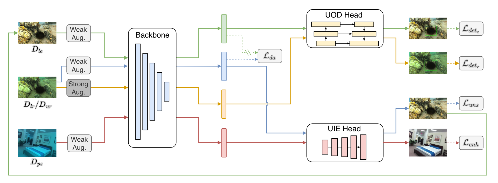
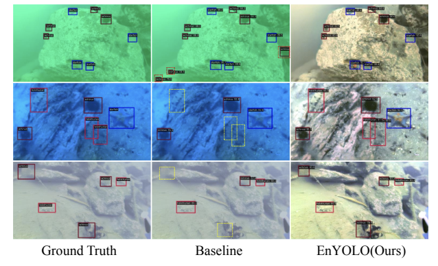

# EnYOLO: A Real-Time Framework for Domain-Adaptive Underwater Object Detectoin with Image Enhancement

This repository contains the official implementation of the paper:

> **EnYOLO: A Real-Time Framework for Domain-Adaptive Underwater Object Detectoin with Image Enhancement** (accepted by ICRA2024)<br>
> Junjie Wen, Jinqiang Cui*, Benyun Zhao, Bingxin Han, Xuchen Liu, Zhi Gao, Ben M. Chen <br>
> **Paper Link**: [[arxiv](https://arxiv.org/pdf/2403.19079)]


## Overview


Overview of our proposed EnYOLO framework during training. There are three training stages in our framework: Burn-In, Mutual-Learning, and Domain-Adaptation.



Visualization of detection results in greenish, bluish, and turbid underwater environments. Our proposed EnYOLO conducts simultaneous UIE and UOD effectively. Yellow dotted rectangles indicate missed detections, while red dotted ones represent incorrect detections.

## Environment preparation
The codes have been tested in Ubuntu 20.04 with CUDA 11.7.
```shell
# Create enyolo conda environment
conda create -n enyolo python=3.10
conda activate enyolo
# Install pytorch
conda install pytorch==1.13.0 torchvision==0.14.0 torchaudio==0.13.0 pytorch-cuda=11.7 -c pytorch -c nvidia
# Install mmdetection
pip install mmengine==0.10.3
pip install mmcv==2.0.1 -f https://download.openmmlab.com/mmcv/dist/cu117/torch1.13/index.html
pip install mmdet==3.3.0
# Install mmyolo
git clone https://github.com/open-mmlab/mmyolo.git
cd mmyolo
pip install -v -e .
# Install enyolo
cd .. && git clone https://github.com/RockWenJJ/enyolo.git
cd enyolo
pip install -e .
```


## Data Preparation
First, you need to download the DUO dataset ([[Ours](https://drive.google.com/file/d/1-M35HsGOcTwR7m1Hxel-NEU7s1zvGrFL/view?usp=drive_link)][[Official](https://github.com/chongweiliu/DUO)]) for detection and SYREA ([[Google Drive](https://drive.google.com/file/d/1oiuuOpZuvqmRmOAI8JqRkRGhY-56gCrv/view?usp=sharing)][[BaiduNetDisk]](https://pan.baidu.com/s/1iVAR_hSVmLMyrWcjm4HbbA) (Code:90gv)) dataset for enhancement.

Then, link the datasets into the project.
```shell
mkdir -p <PATH-TO-ENYOLO>/data && cd <PATH-TO-ENYOLO>/data
ln -s <PATH-TO-DUO-DATASET> duo
ln -s <PATH-TO-SYREA-DATASET> syrea
```

## Training
Activate the conda environment
```shell
conda activate enyolo
```
Train the baseline model
```shell
python tools/train.py ./configs/yolov5s/yolov5s-v61_syncbn_300e_duo.py --work-dir ./work_dirs/yolov5s
```
Train the enyolo model
```shell
python tools/train.py ./configs/enyolov5s/enyolov5s-v61_syncbn_300e_syrea-duo.py --workd-dir ./work_dirs/enyolov5s
```

## Testing
Activate the conda environment
```shell
conda activate enyolo
```
Test the baseline model
```shell
python tools/test.py ./configs/yolov5s/yolov5s-v61_syncbn_300e_duo.py <CHEKPOINT-PATH>
```

Test the enyolo model
```shell
python tools/test.py ./configs/enyolov5s/enyolov5s-v61_syncbn_300e_syrea-duo.py <CHECKPOINT-PATH>
```


## Citation
If you find our repo useful for your research, please consider citing our paper:

```bibtex
@article{wen2024real,
  title={A Real-Time Framework for Domain-Adaptive Underwater Object Detection with Image Enhancement},
  author={Wen, Junjie and Cui, Jinqiang and Zhao, Benyun and Han, Bingxin and Liu, Xuchen and Gao, Zhi and Chen, Ben M},
  journal={arXiv preprint arXiv:2403.19079},
  year={2024}
}
```

### Acknowlegements
The repository is based on [mmyolo](https://github.com/open-mmlab/mmyolo.git) & [mmdetection](https://github.com/open-mmlab/mmyolo.git).
